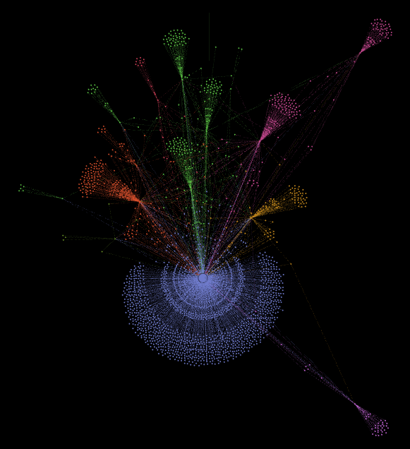
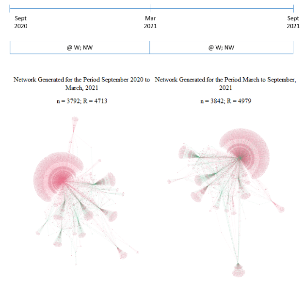

# Social Capital Twitter Data Extractor
Social Capital Twitter Data eXtractor (SCTDX) has been developed as part of a research project of the Universitat Politècnica de Catalunya and uses the twitter API to extract the necessary information to analyse the Social Capital of a group of twitter accounts or users.
Social Capital consists of a series of resources that individuals or groups can mobilise from the structures of the social networks to which they belong. As an example, let us imagine a group of individuals or organisations who wish to promote support for a social cause and who have a large and dense volume of social relationships through which they can mobilise and obtain the support of the members of that network. In some sense, Social Capital is also a measure of the influence that can be exerted in a social network, precisely in order to mobilise the resources available to the group and its members.

Today, social media, and in particular twitter, are the ideal technological service for implementing and developing large networks of relationships. Given the open nature of twitter, it is possible to obtain information about the relationships of a network through its API. The software uses the xxx API (link) and requires an authentication of type xxx or type xxx to be provided for access to the it (link to twitter page on accesses or to request them).

The software has to be provided with the id of a twitter list (which is the number where the url of the list ends) in which the main members or primary nodes of the network to be analysed are included. For example, these members could be the accounts belonging to companies or organisations and individuals relevant to a certain economic sector in a given territory or to an association with a common purpose. The social network of this cluster would be made up of its members -primary nodes-, but also its followers and followees on twitter and those users with whom they interact through mentions, retweets or comments, which we will call secondary nodes. Thus, SCTDX allows the necessary information to be extracted to CSV files for later analysis with network analysis software such as, for example, Ghephi. It is possible to extract the information for the following types of relationship networks:

**Follower-followees network:**

In this case the members (nodes) of the network are all the members of the initial list (primary nodes) and users who follow or are followed by some member of the list (secondary nodes).

The relationships between nodes obtained are the cross-followings between primary nodes and also between primary nodes and secondary nodes. Cross-relationships between secondary nodes are not reflected given the potentially high number of secondary nodes, which would lead to an unfeasible computational cost in terms of API calls. An initial list of 20 members can easily generate a volume of secondary nodes of several hundred thousand, so to obtain the relationships between them would require a volume of API calls in that range.

Both the nodes and the relationships between them are determined for the time of execution since it is not possible to obtain from the twitter API the status of followers and followees at a point in time in the past.

The weight or strength of the relationships is calculated based on the number of interactions -¬mentions, retweets and/or comments- between nodes. The software requests the period of time for which these relationships are to be obtained.

**Mentions network:**

This network is composed of the members of the list (primary nodes) and all those twitter users who are mentioned by the primary nodes or who mention them (secondary nodes). In order to obtain this network it is necessary to provide the period of time to be analysed.

The relationships between the nodes are established through the mentions, there is a relationship between each pair of nodes that mention each other, reflecting the directionality, i.e. who mentions whom.

The weighting or strength of the relationship corresponds to the number of mentions in the time period analyzed.

**Extraction of twits:**

Additionally, the software allows extracting all tweets issued by the list members during the selected period of time. This extraction will allow the analysis of these tweets for different purposes.

## Technologies

Project is created with:
* Software version: 1.0
* Programming Lenguaje: Python
* Graphic Library: PyQT5

## Extractions Supported

- Followers and followees simple
- Followers and followees weighted
- Mentions simple
- Mentions weighted
- Tweets

## Setup

To run this project, install it locally using the auto contened installer.

## Authors

•	Umair Tehami – Developer (linkedin)
•	Antonio Cañabate Carmona - Senior Researcher
•	Natalia Sánchez-Arrieta - Researcher
•	Ferran Sabate Garriga - Researcher

## References

Companies social capital en Twitter. Bachelor’s degree final project
Sánchez-Arrieta, N., González, R. A., Cañabate, A., & Sabate, F. (2021). Social Capital on Social Networking Sites: A Social Network Perspective. Sustainability, 13(9), 5147. 
SANCHEZ-ARRIETA, N., CAÑABATE, A., & SABATE, F. The Impact of Corporate Social Responsibility Communications on Firms' Social Capital Development. A Literature Review. STRATEGICA, 521. 
Social Capital definition

## Contact Information

Umair Tehami - umair.tehami@gmail.com
